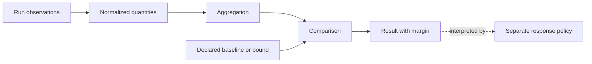

# Measurement Model

This document defines the measurement model for the initial MAGE experiment.
It turns run telemetry into quantities that can be compared across the baseline and MAGE treatment.
It does not define the response to a result; warning, adapting, degrading, or gating remain separate enforcement decisions.

The design follows Chapter 2, Section 2.6 of [*Model-Based Agentic Software Engineering*](agent-guidance-docs/mage-book-2.pdf) and the experiment described in [MAGE Project Guidance](agent-guidance-docs/PROJECT_GUIDANCE.md).

## Model card

| Field | Definition |
| --- | --- |
| **Engineering question** | How much correct, durable work does an agent produce, at what reconstruction and human-attention cost, and how does that compare with the baseline and declared acceptance bounds? |
| **Model** | Typed observations from each run are normalized into quantities, aggregated over a declared scope and time window, and compared with separately declared baselines or bounds. |
| **Property** | Each reported result is attributable to source observations and can be compared with a compatible reference without treating missing data as zero. |
| **Quality attributes** | Correctness, reproducibility, cost-awareness, experimental validity, and operability. |

## Core relation

Raw telemetry is not yet a measurement model.
The model gives an observation engineering meaning by defining its unit, scope, aggregation, and relationship to a reference.



The diagram has one job: show that the reference is declared apart from the observed value.
The comparison produces evidence and preserves margin; it does not choose a consequence.

## Measurement chains

The experiment uses distinct chains because each answers a different question.
Do not collapse them into one score.

| Chain | Source observations | Derived quantity | Reference | Interpretation |
| --- | --- | --- | --- | --- |
| Correctness and acceptance | Task result, test results, benchmark verdict, reviewer acceptance | Completion or acceptance rate | Task acceptance criteria; baseline condition | Whether the treatment preserves or improves correct completion |
| Durable throughput | Landed changes, retained generated code, rework, churn, corrective patches | Retained work per run; rework rate | Baseline distribution or declared tolerance | Whether output survives review and later correction |
| Reconstruction cost | Files read, searches, repeated reads, navigation calls, input tokens, time to first implementation | Reconstruction actions or cost per accepted task | Baseline distribution | Whether explicit models reduce repeated recovery of repository facts |
| Defect escape | Regressions, reopened tasks, architecture violations, policy violations, late failures | Escaped defects or violations per accepted task | Zero where the acceptance contract requires none; otherwise a declared tolerance | Whether apparent efficiency hides lower quality |
| Human-attention burden | Interventions, clarifications, review time, manual corrections, rejected or redirected outputs | Human minutes or interventions per accepted task | Baseline distribution | Whether the treatment reduces work transferred to people |
| Efficiency | Wall-clock time, latency, total tokens, tool calls, attempts, iterations | Resource use per accepted task | Baseline distribution or resource budget | Whether an accepted result consumes fewer resources |
| Bootstrap cost and quality | Bootstrap time and tokens, human corrections, extraction errors, useful coverage, stale facts | Up-front cost; extraction precision and coverage | Declared bootstrap budget and quality thresholds | Whether the reusable models repay their construction cost |

Correct and accepted completion is the primary outcome.
Durable throughput, reconstruction cost, and defect escape follow in that order.
Token or time savings do not establish success when correctness declines.

## Measurement definition

Every measured quantity must declare enough context to reproduce and interpret it.
Use one record per quantity definition.

```yaml
id: reconstruction.files-read
model_class: measurement
question: How many distinct repository files did the agent inspect before its first implementation edit?
scope:
  experiment: mage-initial
  unit_of_analysis: run
  conditions: [baseline, mage]
claim_type: observed
source_authority: generated_model
source_refs:
  - run_event_log
generated_at: 2026-09-23T00:00:00Z
generator_version: commit-or-version
confidence: known
property: files_read can be compared between matched conditions
quality_attribute: reconstruction_cost

quantity:
  name: files_read
  unit: distinct_files
  value_type: integer
  direction: lower_is_better
  aggregation: count_distinct
  time_window:
    start: run_started
    end: first_implementation_edit
  filters:
    include: repository_file_reads
    exclude: harness_bootstrap_reads

reference:
  kind: matched_baseline
  value: unknown
  unit: distinct_files
  tolerance: unknown

missing_data:
  representation: unknown
  policy: exclude_from_calculation_and_report_missingness
```

The example records a definition, not a result.
The baseline value and tolerance stay `unknown` until the experiment supplies or declares them.

## Required fields

### Identity and provenance

- `id`: Stable identifier for the quantity.
- `model_class`: Always `measurement` for records governed by this model.
- `question`: The engineering question the quantity helps answer.
- `scope`: Repository revision, task, run, condition, and unit of analysis.
- `claim_type`: `observed`, `declared`, or `derived`.
- `source_authority`: The authoritative source for the value or bound.
- `source_refs`: Event logs, test reports, review records, configuration, or human decisions used to produce the value.
- `generated_at` and `generator_version`: Provenance required to reproduce derived values.
- `confidence`: `known`, `inferred`, or `uncertain`.

### Quantity semantics

- `name`: Canonical quantity name.
- `unit`: Unit shared by the observation, derived value, and reference.
- `value_type`: Numeric representation and permitted range.
- `direction`: `higher_is_better`, `lower_is_better`, `target`, or `descriptive`.
- `aggregation`: Exact function used to combine observations.
- `time_window`: Start and end events, timestamps, or commit interval.
- `filters`: Included and excluded events.

### Reference semantics

- `kind`: `fixed_bound`, `budget`, `capacity_envelope`, `matched_baseline`, or `target_range`.
- `value`: The declared reference value or interval.
- `unit`: Must be compatible with the measured quantity.
- `tolerance`: Acceptable variation around the reference.
- `source_refs`: Decision, configuration, or baseline data that supplied the reference.

## Comparison result

A comparison retains the values needed to inspect the conclusion.

```yaml
measurement_id: reconstruction.files-read
run_id: run-0001
condition: mage
observed_value: 41
reference_value: 58
unit: distinct_files
delta: -17
relative_delta: -0.2931
margin_to_bound: null
status: lower_than_reference
uncertainty: null
evidence_refs:
  - runs/run-0001/events.jsonl
```

`status` summarizes the comparison but never replaces the underlying values.
When no valid comparison exists, use `unknown` or `not_comparable`; do not manufacture a pass or fail.

## Invariants

An implementation of this model must preserve these rules:

1. **Compatible comparisons.** Compare only quantities with compatible definitions, units, scopes, time windows, filters, and aggregation methods.
2. **Separate references.** Store baselines, budgets, targets, tolerances, and capacity envelopes separately from observations.
3. **Explicit unknowns.** Missing, stale, or invalid observations remain `unknown`; they never become zero, empty, false, or permitted.
4. **Preserved margin.** Retain the observed value, reference value, delta, and uncertainty where available. Do not reduce the record to pass or fail.
5. **Traceable derivation.** Every derived quantity names its source observations and derivation version.
6. **No mixed denominators.** Rate measures declare their denominator, such as `per_run`, `per_attempted_task`, or `per_accepted_task`.
7. **No hidden enforcement.** A comparison reports evidence. A separate policy decides whether to observe, warn, adapt, degrade, or gate.
8. **Primary-outcome priority.** Efficiency gains cannot offset a decline in correctness unless the study protocol explicitly defines that tradeoff.

## Derived relations

Use explicit formulas and define the denominator at each site.
The following relations are starting points, not approved success thresholds.

```text
acceptance_rate = accepted_tasks / attempted_tasks

retained_work_rate = retained_generated_changes / landed_generated_changes

rework_rate = corrective_changes / landed_changes

reconstruction_cost = weighted_sum(
  file_reads,
  searches,
  repeated_reads,
  navigation_calls,
  input_tokens,
  time_to_first_implementation
)

defect_escape_rate = escaped_defects / accepted_tasks

human_attention_per_task = human_attention_minutes / attempted_tasks

efficiency_per_accepted_task = total_resource_use / accepted_tasks
```

Do not use `reconstruction_cost` as a composite until the team approves its weights.
Until then, report its components separately.

## Validation

A validator should reject or flag a measurement when:

- the quantity or reference has no unit;
- the observation and reference units are incompatible;
- the time window or unit of analysis is absent;
- an aggregation has no declared function;
- a rate has no denominator;
- a derived value has no source references or generator version;
- missing data has been encoded as zero;
- baseline and treatment runs use different definitions;
- the repository revision, task, harness, foundation model, tool access, limits, or retry policy differs across a matched comparison;
- a result contains only a status and discards the observed value or margin.

## Initial experiment boundaries

The repository revision, task set, agent harness, foundation model, tool access, resource limits, retry policy, and numeric success thresholds remain open decisions in the project guidance.
This model can define their required fields now, but it must not fill them with inferred values.

For the first fixture, select one measure from each of the four primary outcome groups:

1. accepted completion;
2. retained work or rework;
3. one direct reconstruction observation, such as distinct files read before the first implementation edit;
4. escaped defects or rule violations.

Add human-attention, efficiency, and bootstrap measures after the event schema can collect them consistently.

## Source notes

- Chapter 2, Section 2.6, pages 76-79 defines measurement models as quantities, relations, and separately declared bounds. It also separates measurement from enforcement and treats tolerance and margin as model content.
- [MAGE Project Guidance](agent-guidance-docs/PROJECT_GUIDANCE.md) supplies the shared metadata envelope, experimental measures, priority order, unresolved controls, and the rule that missing values must remain explicit.
